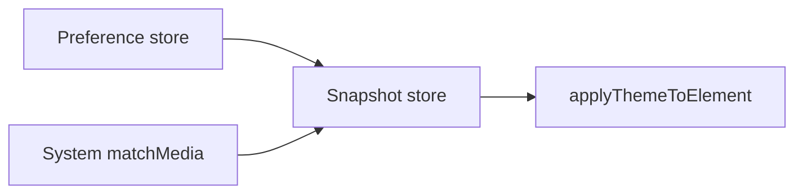

# Runtime switching

Runtime theming is the theme controller: create it once, subscribe to snapshots, apply them to the DOM, and call setters when the user or OS changes preferences. This page covers the full controller surface from `@sometic/theme`.

## Overview

`createThemeController` keeps preferences in an `@sometic/store` (optionally persistent) and derives a `ThemeSnapshot` whenever preferences or system signals change. Your UI layer stays thin: bind snapshot → DOM (or framework state).

### When to use

- Light / dark / system toggles
- Density, RTL, high contrast, reduced motion controls
- Scoped themes on a panel or embed
- SSR-safe create + client hydrate + apply

### When not to use

- Static CSS-only sites with no runtime mode → hand-written variables may be enough
- Class merging without tokens → `@sometic/styling`
- Persistence adapter details alone → [Theme store](/stores/theme)

## Installation

See [Installation](/theming/installation).

## Usage

### Full client bootstrap

```ts
import { createThemeController, applyThemeToElement } from "@sometic/theme";
import { lightTheme, darkTheme } from "@sometic/theme/presets";
import { createWebStorageAdapter } from "@sometic/store/persistent";

const theme = createThemeController({
    themes: [lightTheme, darkTheme],
    defaultThemeId: lightTheme.id,
    lightThemeId: lightTheme.id,
    darkThemeId: darkTheme.id,
    mode: "system",
    persist: true,
    storageKey: "sometic-theme",
    storage: createWebStorageAdapter("localStorage"),
});

await theme.hydrated;

const root = document.documentElement;
let previous = theme.get().cssVariables;

function paint(snapshot: ReturnType<typeof theme.get>): void {
    applyThemeToElement(root, snapshot, { previousVariables: previous });
    previous = snapshot.cssVariables;
}

paint(theme.get());

const stop = theme.subscribe((snapshot) => {
    paint(snapshot);
});

// later
theme.setMode("dark");
theme.setDensity("compact");
theme.setDirection("rtl");
theme.setHighContrast("system");
theme.setReducedMotion(true);

// teardown
stop();
theme.dispose();
```

### Scoped theme on a container

```ts
const panel = document.querySelector("#settings-preview");
if (panel instanceof HTMLElement) {
    applyThemeToElement(panel, theme.get());
    theme.subscribe((snapshot) => {
        applyThemeToElement(panel, snapshot);
    });
}
```

Variables and `data-*` / `dir` live on that element; descendants inherit custom properties.

### System preference without the controller

```ts
import {
    getSystemColorScheme,
    subscribeSystemColorScheme,
    getPrefersReducedMotion,
    getPrefersMoreContrast,
} from "@sometic/theme/system";

getSystemColorScheme(); // "light" | "dark" | "no-preference"
const stop = subscribeSystemColorScheme((scheme) => {
    console.log(scheme);
});
```

The controller already subscribes when mode / flags are `"system"`. Use these helpers for custom UI chrome.

### Contrast helpers at runtime

```ts
import { meetsWcagContrast, pickContrastingColor } from "@sometic/theme/contrast";

meetsWcagContrast("#111827", "#ffffff", "AA", "normal"); // true
pickContrastingColor("#2563eb", "#ffffff", "#111827"); // picks better of light/dark
```

Hex only today (`#rgb` / `#rrggbb`). Non-hex strings fail closed.

## How it works



1. Preferences update via setters or hydrate.
2. System listeners update scheme / contrast / motion when relevant flags are `"system"`.
3. Snapshot rebuilds tokens → CSS variables → attributes.
4. Subscribers receive `(snapshot, previous)`.
5. `dispose` stops listeners and disposes both stores.

`hydrated` resolves immediately when `persist` is not enabled. With persistence, await it before trusting restored prefs. Details: [Theme store](/stores/theme) · [Store](/stores/store).

## API

### `createThemeController(options)`

Returns `ThemeController`.

#### Options

| Option           | Type                            | Default                |
| ---------------- | ------------------------------- | ---------------------- |
| `themes`         | `readonly ThemeDefinition[]`    | required               |
| `defaultThemeId` | `string`                        | required               |
| `lightThemeId`   | `string`                        | `defaultThemeId`       |
| `darkThemeId`    | `string`                        | `defaultThemeId`       |
| `mode`           | `"light" \| "dark" \| "system"` | `"system"`             |
| `density`        | `ThemeDensity`                  | `"comfortable"`        |
| `direction`      | `"ltr" \| "rtl"`                | `"ltr"`                |
| `highContrast`   | `boolean \| "system"`           | `false`                |
| `reducedMotion`  | `boolean \| "system"`           | `"system"`             |
| `prefix`         | `string`                        | `"sometic"`             |
| `persist`        | `boolean`                       | `false`                |
| `storage`        | `StorageAdapter`                | memory when persisting |
| `storageKey`     | `string`                        | `"sometic-theme"`       |

#### Controller members

| Member                                                 | Signature / notes                            |
| ------------------------------------------------------ | -------------------------------------------- |
| `get()`                                                | `() => ThemeSnapshot`                        |
| `subscribe(listener)`                                  | `(snapshot, previous) => void` → unsubscribe |
| `registerTheme` / `unregisterTheme`                    | Registry mutations                           |
| `setMode` / `setTheme` / `setDensity` / `setDirection` | Preference setters                           |
| `setHighContrast` / `setReducedMotion`                 | Flag setters                                 |
| `hydrated`                                             | `Promise<void>`                              |
| `dispose()`                                            | Idempotent cleanup (`Disposable`)            |

#### `ThemeSnapshot`

| Field                 | Description                |
| --------------------- | -------------------------- |
| `preferences`         | Current `ThemePreferences` |
| `resolvedColorScheme` | `"light"` or `"dark"`      |
| `resolvedThemeId`     | Active theme id            |
| `tokens`              | Active `ThemeTokens`       |
| `cssVariables`        | Flat `--…` map             |
| `attributes`          | Attribute map for apply    |

### `applyThemeToElement(element, snapshot, options?)`

Writes CSS variables and attributes. Optional `previousVariables` removes stale properties. Clears inactive contrast/motion attributes.

### System (`@sometic/theme/system`)

| Export                          | Role                             |
| ------------------------------- | -------------------------------- |
| `getSystemColorScheme`          | Current preference               |
| `getPrefersReducedMotion`       | `prefers-reduced-motion: reduce` |
| `getPrefersMoreContrast`        | `prefers-contrast: more`         |
| `subscribeSystemColorScheme`    | Change listener                  |
| `subscribePrefersReducedMotion` | Change listener                  |
| `subscribePrefersMoreContrast`  | Change listener                  |

### Contrast (`@sometic/theme/contrast`)

| Export                 | Role                                             |
| ---------------------- | ------------------------------------------------ |
| `parseHexColor`        | `#rgb` / `#rrggbb` → RGB or `undefined`          |
| `relativeLuminance`    | WCAG relative luminance                          |
| `contrastRatio`        | Ratio between two RGB colors                     |
| `meetsWcagContrast`    | AA/AAA × normal/large                            |
| `pickContrastingColor` | Choose light or dark foreground for a background |

## Edge cases

| Case                                | Behavior                                                                                     |
| ----------------------------------- | -------------------------------------------------------------------------------------------- |
| SSR import                          | Safe; no import-time `window`                                                                |
| No `matchMedia`                     | Scheme falls back toward light; motion/contrast false                                        |
| `persist: true` without web storage | Memory adapter only (tests / ephemeral)                                                      |
| Double `dispose`                    | Safe no-op                                                                                   |
| Subscribe after dispose             | Avoid; dispose tears down stores                                                             |
| Concurrent embeds                   | Create separate controllers; do not share one global singleton unless you own that lifecycle |
| Hex-only contrast                   | Soft limit: extend later for `rgb()` / OKLCH; do not assume support                          |

## FAQ

### Does theme require React?

No. Controllers are framework-agnostic.

### How does `mode: "system"` work?

Resolves light/dark via `prefers-color-scheme`, selecting `lightThemeId` / `darkThemeId`. OS changes rebuild the snapshot while mode stays `system`.

### What about hydrate races?

Await `hydrated` before first paint if you persist. See [Theme store](/stores/theme).

### Reduced motion / high contrast?

Flags accept `true` \| `false` \| `"system"`. Resolved `true` values appear as `data-reduced-motion` / `data-high-contrast` on apply.

### Why soft honesty on contrast?

Ship hex parsing now. Broader CSS color parsing is a deliberate non-goal for the current surface.

## Related

- [Theming overview](/theming/)
- [Themes](/theming/themes)
- [CSS variables](/theming/css-variables)
- [Theme store](/stores/theme)
- [Store](/stores/store)
- [Plain CSS](/theming/plain-css)
